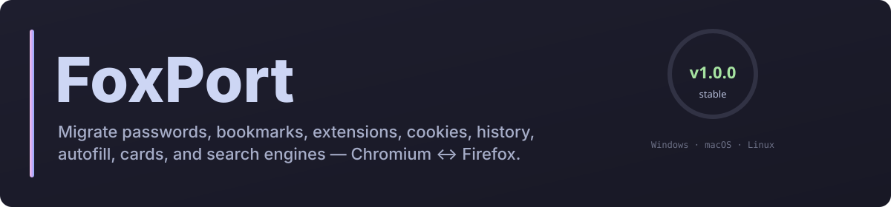
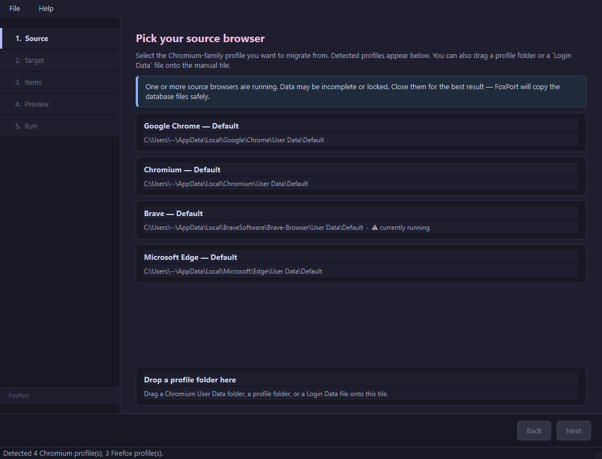
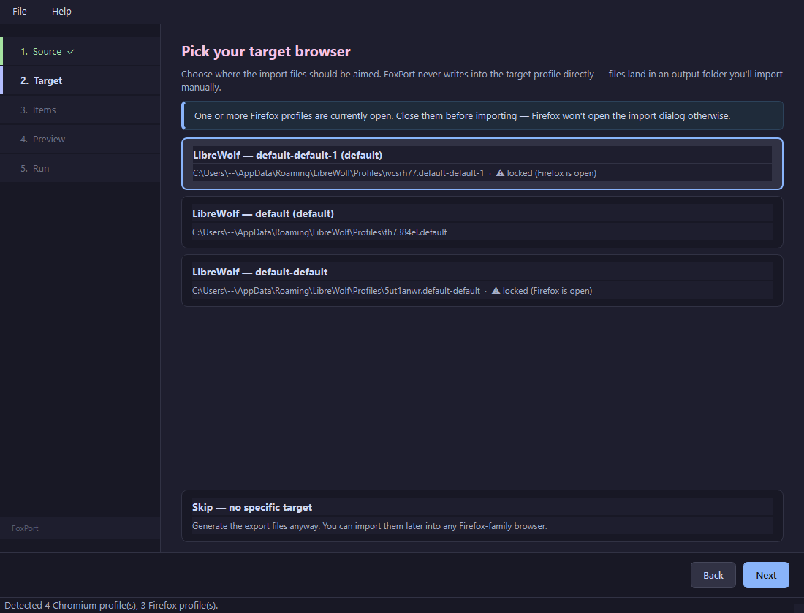
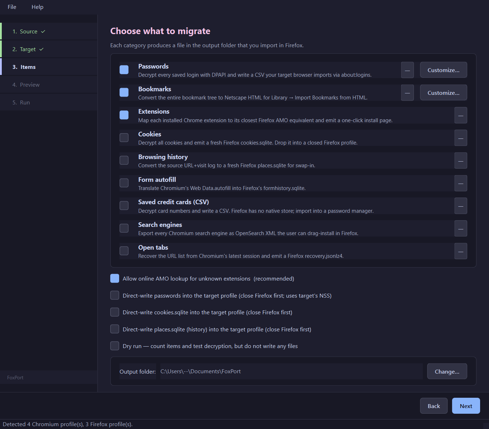
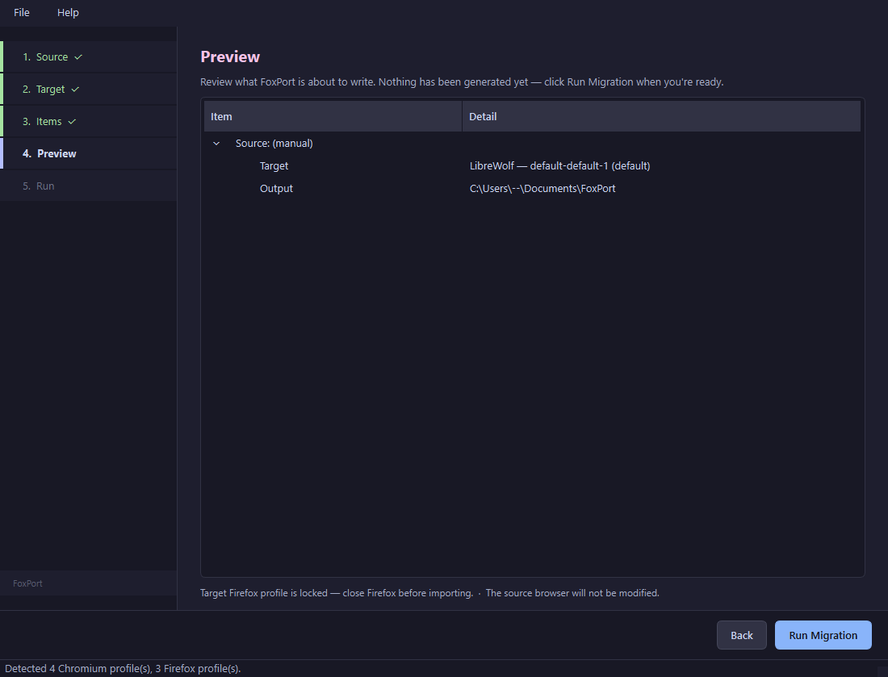
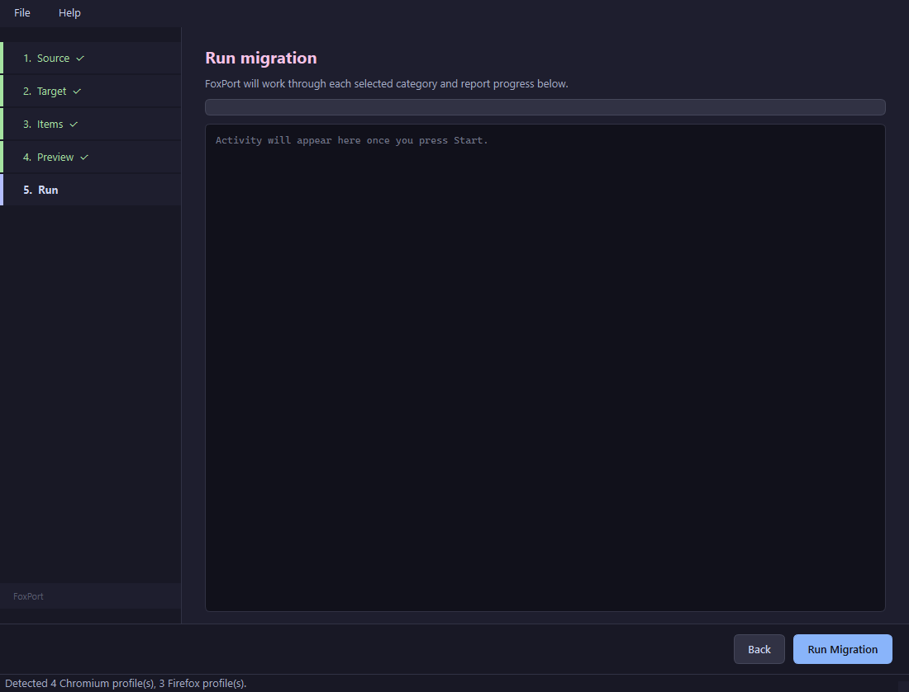

<p align="center">
  
</p>

# FoxPort

[](CHANGELOG.md)
[](LICENSE)
[](#)
[](https://www.python.org/)
[](https://github.com/SysAdminDoc/FoxPort/actions/workflows/ci.yml)

**Port Chromium browsers to Firefox.** FoxPort scans your installed Chromium-family browsers (Chrome, Brave, Edge, Vivaldi, Opera, Arc, Thorium, Yandex, ...), decrypts your saved passwords, packages up your bookmarks, and maps your Chrome extensions to their Firefox equivalents on addons.mozilla.org — all in one click.

The source browser is never modified. FoxPort writes Firefox-native import files into an output folder; you import them through the target browser's normal UI.

## Screenshots

The wizard walks through Source → Target → Items → Preview → Run/Done with a
left-rail step indicator and Catppuccin Mocha dark theme:

<p align="center">
  
  
</p>
<p align="center">
  
  
</p>
<p align="center">
  
</p>

## What's new in v1.2.0

**Research-driven correctness pass** — fixes for three P0 bugs identified
in the archived research plan plus a basket of P1/P2 trust + polish wins.

- **Correct `places.sqlite`** — schema bumped to Firefox tip (v86), new
  `block_until_ms` / `block_pages_until_ms` columns on `moz_origins`,
  `url_hash` now uses a Mozilla `mfbt::HashString` port (new
  `crypto/mozhash.py`) so AwesomeBar dedup actually works.
- **Working open-tabs SNSS extractor** — proper Pickle-aware parser that
  reads both `Sessions/Session_*` AND `Sessions/Tabs_*` files. Verified
  live: previous extractor returned 0 URLs; new one returns 12 from the
  same Chrome profile.
- **48-test pytest suite** — `tests/` tree with synthetic fixtures for
  Chromium Bookmarks JSON, History SQLite, SNSS Tabs files. CI runs
  `pytest` cross-platform.
- **HIBP password scan** (opt-in, free k-anonymity API). Produces
  `compromised-passwords.txt` with URL+username (no plaintext).
- **Drag-and-drop "Manual source" tile now works** — promotes the
  dropped folder into a synthetic `ChromiumProfile` and the wizard
  proceeds with it.
- **Quick wins** — `cookies.sqlite` `updateTime` column; `favicons.sqlite`
  backed up instead of deleted; `chrome://` / `about:` / `edge://` URLs
  filtered from bookmarks + history + open-tabs by default;
  `diff` CLI refuses ambiguous profile matches; master-password retry
  loop (3 attempts); password preview masks values by default with a
  Show-all toggle; already-installed extensions fold into a collapsed
  `<details>` block in `extensions.html`; reverse-extensions
  `AMO_GUID_TO_CHROME` cleaned up; `check_curated_map.py --strict-stale`.
- **History time-range filter** — Last 7 / 30 / 90 days, last 12 months,
  custom range. Surfaced via "Customize…" on the History row.
- **Settings page** (File → Settings…) persisted to per-platform JSON
  (`%APPDATA%/FoxPort/config.json`, `~/Library/Application Support/...`,
  `$XDG_CONFIG_HOME/FoxPort/...`).
- **Path-traversal hardening** on `make_export_dir` — slug-safe
  characters, resolved-path bounds check.
- **`formhistory.sqlite` v5** schema with `moz_sources` +
  `moz_history_to_sources` tables.
- **`NSSSession.decrypt()`** method centralizes the previously-inline
  `PK11SDR_Decrypt` ctypes call.
- **Reverse-map harvester** (`scripts/harvest_reverse_map.py`) auto-
  populates `AMO_GUID_TO_CHROME` from the forward curated map via the
  AMO detail API.

## What's new in v1.1.0

- **GUI direction toggle** — A segmented Chromium → Firefox / Firefox →
  Chromium selector on the Source step; the Source and Target pages swap
  their tile lists when you flip it. Items step disables the categories
  not yet supported in reverse mode.
- **Master-password prompt** — Reverse mode auto-prompts via a Qt
  password dialog when the Firefox source has one set, then retries NSS
  with the entered string. Cancel aborts the migration cleanly.
- **Direct-write cookies + history** — Sibling checkboxes to the existing
  direct-write-passwords one on the Items step. Each backs up the
  pre-existing file in the target profile to a timestamped sibling,
  refuses on locked profile, and for history additionally deletes
  `favicons.sqlite` so Firefox rebuilds it from the imported visits.
- **Open tabs migration** — Reads the most recent Chromium
  `Sessions/Session_<n>` SNSS binary, scans for UTF-16LE-encoded URLs
  (RFC 3986 char class to avoid bleed between fields), and emits a
  Firefox-compatible `recovery.jsonlz4` (`mozLz40\0` magic + lz4-block-
  compressed JSON). Optional direct-write to
  `sessionstore-backups/recovery.jsonlz4`.
- **Profile diff** — New CLI `diff` subcommand reports
  passwords/bookmarks/extensions that exist in source but not in target,
  with samples. Useful before committing a migration: `python -m
  foxport.cli diff --source "Brave/Default" --target "Firefox/default-release"`.
- **Curated-map auditor** — `scripts/check_curated_map.py` hits AMO for
  every slug in the curated map, flags 404s / disabled / stale entries,
  exits non-zero on broken results. Designed for monthly CI runs.

## What's new in v1.0.0

- **Reverse direction (Firefox → Chromium)** is now supported through the
  CLI as `python -m foxport.cli migrate-reverse --source "Firefox/default-
  release" --items passwords,bookmarks,extensions`.
- **Firefox-side readers** (`browsers/firefox_read.py`) — NSS-decrypt
  `logins.json`, walk `places.sqlite` for bookmarks, parse
  `extensions.json` for installed AMO add-ons.
- **Reverse migrators** in `foxport/migrate_reverse/`:
  - `passwords.py` writes Chrome's `name,url,username,password,note` CSV.
  - `bookmarks.py` writes a Netscape HTML with the Firefox toolbar root
    promoted to Chrome's `PERSONAL_TOOLBAR_FOLDER`.
  - `extensions.py` inverts the curated map and falls back to a Chrome
    Web Store text-search URL for unmapped AMO GUIDs.

## What's new in v0.6.0

- **Form autofill migration** — Chromium `Web Data.autofill` becomes a
  Firefox v4-schema `formhistory.sqlite` with proper `firstUsed/lastUsed`
  µs conversion and base64-encoded `guid`s.
- **Saved cards CSV export** — Decrypt credit card numbers from
  `Web Data.credit_cards` and write a 1Password-importable CSV. Firefox
  has no native card store, so the CSV is informational.
- **Search engines export** — Read `Web Data.keywords` and emit a
  machine-readable `search-engines.json` inventory plus a per-engine
  OpenSearch XML descriptor (`search-engines/<slug>.xml`) the user can
  drag-install in Firefox. Chromium-specific URL tokens
  (`{google:baseURL}` etc.) stripped during emission.
- All new categories work cross-platform (Windows/macOS/Linux) and honor
  dry-run mode.

## What's new in v0.5.0

- **macOS support** — Chromium-family profiles under
  `~/Library/Application Support/<vendor>`, Firefox-family profiles under
  `~/Library/Application Support/<vendor>/profiles.ini`. Master keys
  recovered from the Keychain (`security find-generic-password -s
  "<Browser> Safe Storage"`) + PBKDF2-SHA1 with 1003 iterations,
  AES-128-CBC decrypt for `v10` blobs.
- **Linux support** — Chromium-family profiles under `~/.config/<vendor>`
  (or `$XDG_CONFIG_HOME`), Firefox-family under `~/.mozilla/firefox/`,
  `~/.librewolf/`, `~/.floorp/`, `~/.waterfox/`, `~/.zen/`, etc. Master
  key recovered via `secret-tool` → `kwallet-query` → `"peanuts"`
  plaintext fallback, PBKDF2-SHA1 with 1 iteration. NSS lookup covers
  `/usr/lib/firefox/libnss3.so`, distro-package locations, Flatpak, Snap.
- **Browser-running detection** is now Linux/macOS-aware (`ps -axo comm=`
  instead of `tasklist`).
- All five migration paths (passwords, bookmarks, extensions, cookies,
  history) work identically across all three platforms.

## What's new in v0.4.0

- **CLI mode** — `python -m foxport.cli list` enumerates detected profiles;
  `python -m foxport.cli migrate --source "Brave/Default" --target
  "Firefox/default-release" --all --dry-run` runs a full migration without
  the GUI. Substring matching on profile names.
- **Per-folder bookmark filter** — A new "Customize…" button on the Items
  step opens a tree dialog where you untick branches you don't want in
  `bookmarks.html`. Selections persist across re-opens.
- **Password preview & per-row filter** — Sibling "Customize…" button
  decrypts everything in a searchable table; tick rows in/out and the CSV
  export honors the selection. Per-row checkboxes default to "include all".
- **NSS direct write** — Opt-in checkbox. When the target Firefox profile is
  selected and **closed**, FoxPort loads the target install's `nss3.dll`
  via ctypes, encrypts each login with `PK11SDR_Encrypt`, and writes
  directly into `logins.json` (+ `logins-backup.json`). The previous
  `logins.json` is backed up to a timestamped sibling. CSV is still emitted
  alongside for audit/safety.
- **Conflict-safe direct write** — Deterministic GUIDs mean an existing
  matching entry is skipped, not duplicated.

## What's new in v0.3.0

- **Cookies migration** — Decrypt all cookies with the AES-GCM key (including
  the SHA-256 HOST_KEY prefix Chrome 130+ silently added) and emit a fresh
  Firefox v17-schema `cookies.sqlite`. Swap into a closed Firefox profile.
- **History migration** — Read Chromium `History` (URLs + visits) and write a
  fresh Firefox v77-schema `places.sqlite` with `moz_origins`, `moz_places`
  (`frecency=-1`, `recalc_frecency=1`, scheme-tagged `url_hash`), and
  `moz_historyvisits`. Bookmarks tree left empty (HTML import flow handles
  those).
- **Dry-run mode** — A checkbox on the Items step runs detection + decryption
  tests and produces no on-disk artifacts. Useful for ABE/credentialed
  troubleshooting.
- **App-Bound Encryption recovery** — `foxport_abe.exe` sidecar in
  `tools/abe_sidecar/` calls the per-browser `IElevator` COM interface
  (UAC-prompted) and returns the AES master key. Hooked into `load_master_key`
  so passwords/cookies on Chrome 127+ / Brave 1.86+ profiles decrypt
  automatically once the sidecar is built and dropped into `foxport/data/`.
- **Two new action buttons on the Done screen** — Reveal cookies.sqlite /
  places.sqlite in Explorer, since these aren't files you double-click.

## What's new in v0.2.0

- **Five-step wizard UI** — Source → Target → Items → Preview → Run/Done, with a left-rail step indicator, tile-based pickers, drag-and-drop support, and a sample-rich preview pane before commit.
- **Smarter extension matching** — A 52-entry curated map plus a manifest-`gecko.id` probe against the AMO detail endpoint plus permission-overlap confidence scoring on every match.
- **Already-installed detection** — FoxPort reads the target Firefox profile's `extensions.json` and strikes through extensions you already have so a click-through install doesn't re-tap them.
- **App-Bound Encryption awareness** — Detects Chrome 127+ ABE on the source and reports clearly. Bookmarks and extensions still migrate; passwords on ABE-only profiles are flagged for v0.3.
- **Opera Stable / GX flat-profile layout** — Now detected correctly (no `Default/` subdir).
- **Browser-running banner** — Surfaces when a source browser is running so you know the data may be stale.
- **Deterministic password GUIDs** — Re-running the migration produces stable GUIDs so Firefox dedupes instead of inserting duplicates.

---

## What gets migrated

| Item | Source | Destination format | How to import |
| --- | --- | --- | --- |
| **Passwords** | `Login Data` SQLite + DPAPI key (+ ABE sidecar for Chrome 127+) | Firefox CSV (`url,username,password,...`) | `about:logins` → menu → Import from a File |
| **Bookmarks** | `Bookmarks` JSON | Netscape HTML | Library (`Ctrl+Shift+O`) → Import Bookmarks from HTML |
| **Extensions** | Profile `Extensions/<id>/<ver>/manifest.json` | HTML page of AMO install links | Open the HTML in Firefox, click each link |
| **Extension settings** | Allowlisted storage for uBO, Stylus, Bitwarden | `extension-settings.json` | Opt in per extension; import through each add-on's own UI |
| **Cookies** | `Network/Cookies` SQLite + DPAPI key | Firefox `cookies.sqlite` (v17) | Close Firefox, back up existing, drop in |
| **History** | `History` SQLite (`urls` + `visits`) | Firefox `places.sqlite` (v77; includes matching download annotations when paired with history direct-write) | Close Firefox, back up existing, drop in |
| **Form autofill** | `Web Data.autofill` SQLite | Firefox `formhistory.sqlite` | Close Firefox, back up existing, drop in |
| **Saved cards** | `Web Data.credit_cards` + AES key | CSV (1Password import shape) | Firefox has no native store — import into a password manager |
| **Search engines** | `Web Data.keywords` SQLite | OpenSearch XML per engine + JSON inventory | Open each XML in Firefox → Settings → Search → Add |
| **Downloads** | `History.downloads` + `downloads_url_chains` | Portable CSV, plus Firefox `moz_annos` download metadata when history direct-write is applied | CSV is a reference artifact; direct-write makes matching rows visible in Firefox history/download surfaces |
| **Passkeys** | Known/likely WebAuthn stores | Inventory only (`passkeys inventory`) | No export yet; counts only until CXF/CXP support exists |

---

## Supported source browsers

Google Chrome (stable / Beta / Canary), Chromium, **Brave** (stable / Beta / Nightly), Microsoft Edge (stable / Beta / Dev), Vivaldi, Opera, Opera GX, Yandex, Arc, Thorium.

Any browser that follows the Chrome `User Data\<profile>` layout will be picked up automatically. Each browser's individual profiles (Default, Profile 1, Profile 2, ...) are detected separately.

## Supported destinations

Firefox (stable / Nightly / ESR), **LibreWolf**, Waterfox, Floorp, Mullvad Browser, Tor Browser, Zen Browser.

Any Gecko-based browser that ships a `profiles.ini`.

---

## Install

Requires Python 3.11+. Windows-first, but the runtime and CI matrix
cover Windows / macOS / Linux — same install steps everywhere; activate
the venv with `.venv\Scripts\activate` on Windows or `. .venv/bin/activate`
on macOS / Linux.

```bash
git clone https://github.com/SysAdminDoc/FoxPort.git
cd FoxPort
python -m venv .venv
.venv\Scripts\activate
pip install -r requirements.txt
python -m foxport
```

---

## How it works

### Passwords
Chromium (since v80) wraps the AES-256 master key for the password store with Windows DPAPI and stores it in `Local State` under `os_crypt.encrypted_key`. Each saved password is an AES-256-GCM blob in the `Login Data` SQLite database, tagged with a `v10`/`v11` prefix, nonce, ciphertext, and auth tag.

FoxPort:
1. Loads `Local State`, base64-decodes the wrapped key, strips the `DPAPI` prefix, and calls `CryptUnprotectData`.
2. Copies `Login Data` to a temp directory (so it works even while the browser is running and holds a write-lock), opens it read-only, and decrypts each entry with `cryptography.AESGCM`.
3. Converts each row's Chromium WebKit timestamps (microseconds since 1601-01-01 UTC) to Firefox milliseconds since 1970-01-01 UTC, generates a fresh GUID, and writes the result as a CSV that `about:logins` natively imports.

DPAPI only works on the same Windows user account that originally encrypted the data. Running FoxPort against a copy of someone else's profile won't decrypt their passwords — by design.

### Bookmarks
The `Bookmarks` file is plain JSON. FoxPort walks the `bookmark_bar`, `other`, and `synced` roots, converting them to the Netscape Bookmark HTML format that Firefox (and every other browser) has imported for two decades. The bookmark bar is tagged with `PERSONAL_TOOLBAR_FOLDER="true"` so it lands in Firefox's Bookmarks Toolbar.

### Extensions
Chrome and Firefox both speak WebExtensions, but Chrome's MV3 lockdown means extensions are not byte-for-byte portable. FoxPort instead resolves the **identity** of each Chrome extension through four progressively-less-confident stages:

1. **Curated map** (`foxport/data/curated_extension_map.json`) — 52 hand-verified Chrome ID → AMO slug pairs across 14 categories (ad blockers, password managers, userscripts, dev tools, AI assistants, ...). Zero network. Open the JSON file to contribute additions. The weekly `curated-map-audit.yml` workflow re-verifies every slug against AMO and files a GitHub issue on broken or removed entries. The `_meta.entry_count` field is asserted by the auditor so the docs can't drift again silently — see `_meta.description` for the dead-link policy. Advanced users/CI can point `FOXPORT_CURATED_MAP_PATH` at a replacement JSON; FoxPort reloads the active map for every run.
2. **Gecko ID probe** — If the Chromium manifest declares `browser_specific_settings.gecko.id`, FoxPort hits AMO's detail endpoint with that GUID for a 100%-confidence match. Duplicate GUIDs share one in-run AMO cache.
3. **AMO name search** — Otherwise, the localized extension name is queried against `addons.mozilla.org/api/v5/addons/search/` and the top hit is taken, ranked by exact-name + prefix overlap, filtered to public + non-disabled. Duplicate names share the same in-run AMO cache.
4. **Permission overlap** — For non-curated matches, FoxPort compares Chrome's declared permissions to the candidate's AMO permissions and downgrades confidence when overlap is poor (`amo-search-low` if < 30%).

The resulting `extensions.html` shows match confidence, permission requests, user count, AMO rating, and whether the equivalent is already installed in your target Firefox profile (struck through). Offline runs (uncheck "Allow online AMO lookup") still produce a usable page from the curated table.

Extension settings are separate and opt-in. FoxPort currently allowlists
uBlock Origin filter/user rules, Stylus user styles, and Bitwarden self-hosted
server URLs. It writes `extension-settings.json` only with those fields; raw
extension storage, auth tokens, cached vault data, and other private keys are
not copied.

---

## Output layout

```
%USERPROFILE%\Documents\FoxPort\
└── 20260523-114205_Brave_-_Default__to__Firefox_-_default-release\
    ├── passwords.csv         # for about:logins
    ├── bookmarks.html        # for Library import
    ├── extensions.html       # one-click AMO install page
    ├── extensions.json       # machine-readable mapping
    ├── extension-settings.json # opt-in allowlisted settings
    └── README.txt            # step-by-step import instructions
```

The output folder is configurable in the UI.

---

## Environment overrides

- `FOXPORT_NSS_PATH` — absolute path to a Firefox `nss3.dll` /
  `libnss3.dylib` / `libnss3.so`. Lets NSS direct-write target portable
  Firefox installs that aren't in the standard search paths.

## Security notes

- **Source profile read-only.** FoxPort copies SQLite files to a temp dir before reading; it never writes to `Login Data`, `Bookmarks`, or anything else in the source profile.
- **Local-only by default.** Decryption happens on your machine. Four optional network calls exist and all can be turned off:
  - AMO lookup for extension names + GUIDs (the "Allow online Add-ons lookup" checkbox / `--no-online` flag).
  - The HIBP `https://api.pwnedpasswords.com/range/<prefix>` breach scan, opt-in via the Items step or `--hibp`. Uses k-anonymity — only the first five hex chars of each `SHA-1(password)` go over the wire and the `Add-Padding: true` header is set. Plaintext never leaves the box.
  - Glean migration telemetry to `https://incoming.telemetry.mozilla.org`, opt-in via Settings or `--telemetry`. It sends only selected category slugs, aggregate counts, direction, dry-run/direct-write flags, and outcome. It never sends paths, profile labels, URLs, hostnames, usernames, filenames, or secrets. See `docs/telemetry.md`.
  - Sentry crash reporting, opt-in via Settings or CLI `--crash-reporting` and only active when `FOXPORT_SENTRY_DSN` or `SENTRY_DSN` is configured. It disables locals/source context, strips paths before send, and does not enable Sentry's default argument/log/module integrations. See `docs/crash-reporting.md`.
- **Output files contain plaintext passwords.** Treat `passwords.csv` and `saved-cards.csv` like secrets. Delete them after importing.
- **`manifest.json` per run.** Every non-dry-run migration writes a schema-versioned manifest next to `README.txt` listing every emitted artifact with its SHA-256, size, sensitivity label, and (when applicable) the absolute path of any direct-write backup. Plaintext secret values never appear in the manifest, only metadata about the files that contain them.
- **Direct-write into Firefox only via atomic replace.** When you opt in to writing `logins.json` / `cookies.sqlite` / `places.sqlite` / `recovery.jsonlz4` straight into a closed target profile, FoxPort stages the file in a temp dir, fsyncs, and swaps it atomically — an interrupted write can never leave a half-written file in your profile. Backups of the previous file are kept under timestamped names so a regret-undo is always possible. Cookies/history can use the `merge` policy to preserve the target DB and add only source cookies absent by host/path/name or source history visits absent by URL+visit timestamp.
- **DPAPI scoping.** Decryption only succeeds when running as the Windows user who originally saved the passwords.
- **App-Bound Encryption** (Chrome 127+, Brave) is detected and surfaced clearly; a full ABE bypass via the `foxport_abe.exe` sidecar ships when the signed-release pipeline lands.
- **NSS version guard.** Before any direct-write into `logins.json` FoxPort checks the version reported by the loaded `nss3.dll`. Below NSS 3.x we refuse — set `FOXPORT_NSS_FORCE=1` to override only if you know what you're doing.
- **SBOM + signed build provenance.** Each release publishes a CycloneDX SBOM of the bundled Python dependencies plus a SLSA build-provenance attestation signed via GitHub OIDC + Sigstore. Verify with `gh attestation verify FoxPort-<tag>-windows-x64.zip --owner SysAdminDoc --repo SysAdminDoc/FoxPort`. See [docs/supply-chain.md](docs/supply-chain.md).

---

## Roadmap

See [ROADMAP.md](ROADMAP.md).

## Project Planning

- [ROADMAP.md](ROADMAP.md) — active to-do list.
- [COMPLETED.md](COMPLETED.md) — shipped roadmap history.
- [RESEARCH_REPORT.md](RESEARCH_REPORT.md) — research summary and archive index.
- [CHANGELOG.md](CHANGELOG.md) — release-level details.

## Changelog

See [CHANGELOG.md](CHANGELOG.md).

## License

MIT — see [LICENSE](LICENSE).
